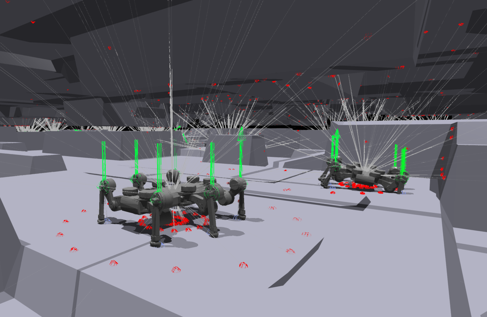
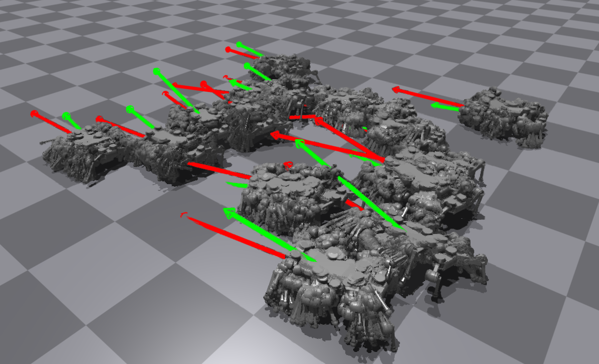

# Extended Isaac Gym Environments for Legged Robots

  
  

> [!WARNING]
> This repository is still under development. Documentation is incomplete and the code may contain bugs.

This repository extends the original [legged_gym](https://github.com/leggedrobotics/legged_gym).

## Newly Added Features

- **`rsl_rl` 3.3.0 support**: Update support from rsl_rl 1.0.2 to 3.3.0.
- **Nvidia Warp SDF & Raycasting**: Integration of Nvidia Warp SDF, raycasting and depth camera for enhanced environment interaction.
- **Main-Rollout Environment Architecture**: Implementation of a main-rollout architecture for sampling-based methods.
- **Confined Terrain Generation & OBJ Terrain Support**: Added confined terrain generation and support for OBJ terrains.
- **Miscellaneous Enhancements**:
  - gym_visualizer integration
  - benchmarking tools
  - etc.
