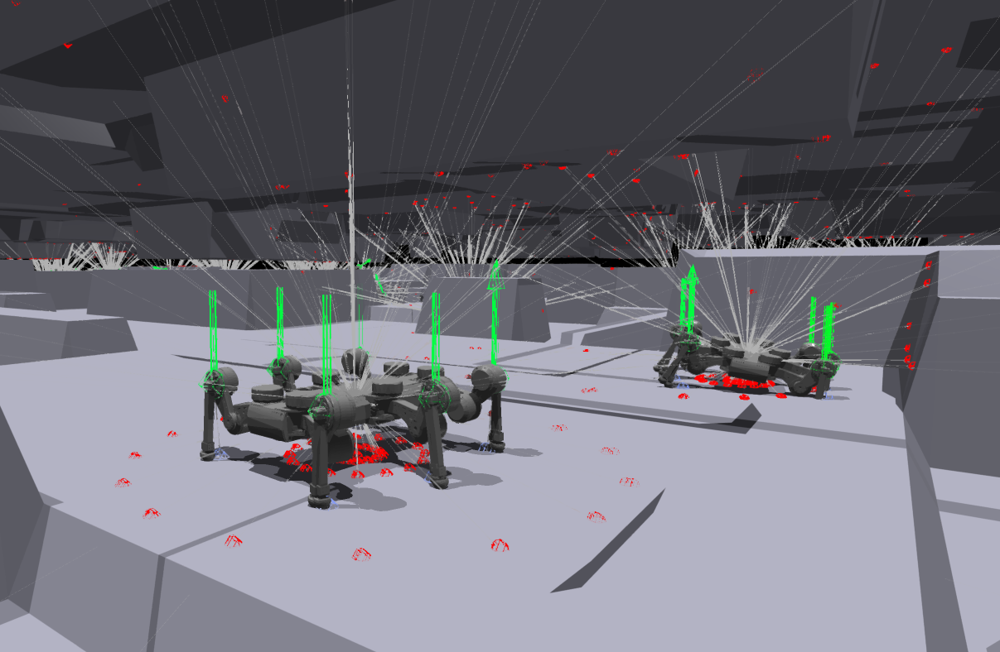
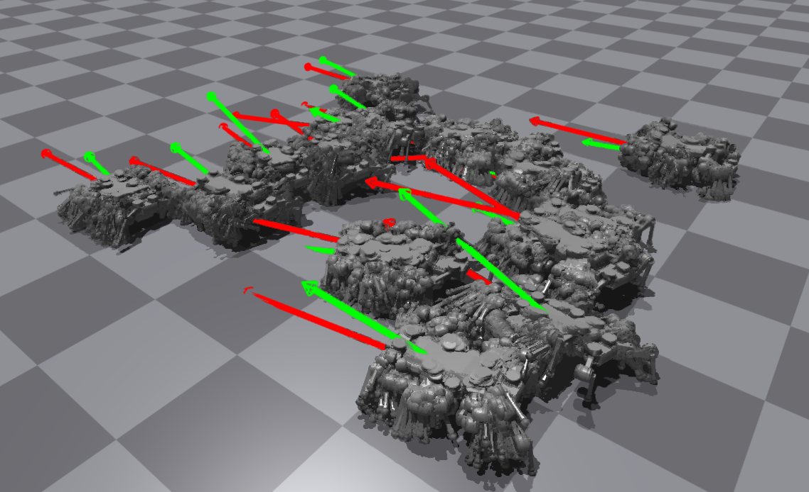

# Extended Isaac Gym Environments for Legged Robots

<div align="center">
  
  
</div>

> [!WARNING]
> This repository is still under development. Documentation is incomplete and the code may contain bugs.

This repository extends the original [legged_gym](https://github.com/leggedrobotics/legged_gym).
And is used as an submodule in [PegasusFlow](https://github.com/MasterYip/PegasusFlow)

## Newly Added Features

- **`rsl_rl` 3.3.0 support**: Update support from rsl_rl 1.0.2 to 3.3.0.
- **Nvidia Warp SDF & Raycasting**: Integration of Nvidia Warp SDF, raycasting and depth camera for enhanced environment interaction.
- **Main-Rollout Environment Architecture**: Implementation of a main-rollout architecture for sampling-based methods.

<div class="columns is-centered has-text-centered is-vcentered">
    <div class="column is-fullwidth is-centered">
        <video id="method_video" autoplay controls muted loop playsinline width="70%">
            <source src="doc/anymal_rollout.mp4" type="video/mp4">
        </video>
    </div>
</div>

https://github.com/user-attachments/assets/f9a9bcac-ec0e-4ffe-bc07-01bdd7ab75f7

- **Confined Terrain Generation & OBJ Terrain Support**: Added confined terrain generation and support for OBJ terrains. To generate OBJ terrains, you can refer to [leggedrobotics/terrain-generator](https://github.com/leggedrobotics/terrain-generator), [MasterYip/blender_robotic_utils](https://github.com/MasterYip/blender_robotic_utils).
- **Miscellaneous Enhancements**:
  - gym_visualizer integration
  - benchmarking tools
  - etc.

## EL4090 Envelope Visualization

The standalone LiDAR example generates a sparse 2D point cloud, computes the
maximum point-free envelope in the declared capped polygon family, exports
admissible joint intervals, and animates an EL4090 pose that satisfies both the
joint and envelope constraints. It does not load an RL checkpoint.

Run from the repository root:

```bash
cd legged_gym
conda activate isaacgym
python legged_gym/scripts/visualize_lidar_free_envelope_gym.py \
  --seed 4090 \
  --point_count 20 \
  --directions 48 \
  --near_band_fraction 0.05 \
  --lateral_robot_clearance 0.025 \
  --lateral_anchors_per_side 5
```

### LiDAR example parameters

| Parameter | Default | Meaning |
| --- | ---: | --- |
| `--seed` | `4090` | Deterministic cloud seed. Pressing `G` increments it and regenerates the cloud and envelope. |
| `--point_count` | `20` | Number of synthetic returns. Counts up to the direction count use unique sectors. |
| `--directions` | `48` | Number of fixed polygon support normals. Must be at least 8. Faces without a return retain the pre-obstacle reachable-support cap. |
| `--lateral_anchors_per_side` | `5` | Number of sectors nearest each of $+y$ and $-y$ reserved for lateral returns. The default dedicates 10 of 20 points to the middle-leg workspaces. |
| `--near_band_fraction` | `0.05` | Maximum fraction of the feasible radial annulus used by primary returns. In $r=r^-+\alpha(r^+-r^-)$, this bounds $\alpha$. Lateral anchors use at most 35% of this value, or 1.75% by default. Valid range: $(0,1]$. |
| `--robot_clearance` | `0.05` m | Minimum assigned-normal clearance for non-lateral returns. |
| `--lateral_robot_clearance` | `0.025` m | Aggressive minimum clearance for lateral anchors. Must be greater than `--point_clearance` and no greater than `--robot_clearance`. |
| `--point_clearance` | `0.02` m | Required separation between a return and its active prescribed-envelope face. The default lateral envelope therefore has approximately 0.005 m baseline slack. |
| `--reference_containment_margin` | `0.005` m | Inward margin applied to the pre-obstacle reachable reference when generating returns. Must be positive. |
| `--min_radius` / `--max_radius` | `0.0` / `2.10` m | Global radial bounds. The robot-clearance and reachable-reference constraints can tighten these bounds per ray. |
| `--min_candidate_reduction_fraction` | `0.05` | Minimum fraction of unconstrained joint candidates that the generated envelope must reject. |
| `--min_joint_shrink_rad` | `0.03` rad | Required minimum shrinkage of at least one exported joint interval. |
| `--motion_period_steps` | `120` | Simulator steps per deterministic joint-motion cycle. |
| `--max_steps` | `0` | Viewer lifetime in steps. `0` is interactive; a positive value runs a bounded validation and exits naturally. |
| `--compute_only` | off | Compute geometry and run the motion compliance sweep without creating a viewer. |
| `--no_motion` | off | Start with joint and occupied-envelope animation paused; press `M` to resume. |
| `--screenshot` | unset | External PNG output path. A matching JSON evidence file is written beside it; paths inside this repository are rejected. |
| `--screenshot_step` | `5` | Frame used for automatic capture when `--screenshot` is configured. Set it below `--max_steps` for bounded runs. |
| `--compute_device_id` / `--graphics_device_id` | `0` / `0` | Isaac Gym compute and rendering device indices. |

For stronger middle-leg constraints, increase `--lateral_anchors_per_side`,
reduce `--near_band_fraction`, or reduce `--lateral_robot_clearance` while
keeping it greater than `--point_clearance`. The last option changes the
lateral safety contract; the first two only change sampling density and radial
placement within that contract.

The viewer uses two vertically offset strokes for every envelope, LiDAR, and
HAA line primitive. See the complete [envelope visualization guide](legged_gym/doc/envelope_visualization.md)
for bounded runs, evidence capture, controls, color semantics, and
troubleshooting.
