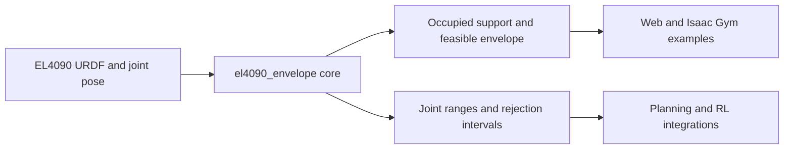

# el4090_envelope

`el4090_envelope` is the standalone mathematical implementation of the EL4090
occupied-body support-envelope model. It provides batched Torch forward
kinematics, capsule support functions, finite-normal envelopes, deterministic
range export, and reference-pinned or existential rejection projections. The
installable core has no Isaac Gym, RL environment, web framework, or
`agent_team` dependency; optional repository examples are kept outside `src/`.



## Layout

- `src/el4090_envelope/model.py`: kinematics, capsules, support/envelope and rejection math.
- `src/el4090_envelope/geometry.py`: reusable half-space and arc geometry.
- `tests/`: deterministic unit, regression, edge-case, and serialization checks.
- `examples/web_viewer/`: self-contained ENV-VIS-015 interactive viewer.
- `examples/isaac_gym/`: original kinematic, LiDAR, and slider viewers.
- `docs/`: mathematics, implementation/API, and migration notes.

## Editable install

From the `el4090_envelope/` directory, install the package into the active
Python environment:

```bash
python -m pip install -e .
python -c "import el4090_envelope; print(el4090_envelope.__version__)"
python -m unittest discover -s tests -v
```

The editable install makes `import el4090_envelope` work from any directory and
keeps it linked to this checkout, so source edits are visible without
reinstalling. The distribution name used by pip is `el4090-envelope`; the
Python import name is `el4090_envelope`. To install from the parent
`extended_legged_gym/` directory, run
`python -m pip install -e ./el4090_envelope`.

Basic model construction:

```python
from pathlib import Path
import torch
from el4090_envelope import (
    BatchedUrdfKinematics, capsule_support, default_el4090_capsules,
    load_urdf_joints, support_directions,
)

kinematics = BatchedUrdfKinematics(load_urdf_joints(Path("robot.urdf")))
directions = support_directions(32)
q = torch.zeros(1, 18)
occupied_support = capsule_support(
    kinematics, q, default_el4090_capsules(), directions,
)
```

Continue with [docs/usage.md](docs/usage.md) for detailed API workflows,
[docs/math.md](docs/math.md) for the model and approximation contract,
[docs/implementation.md](docs/implementation.md) for architecture/API ownership,
[docs/isaac_gym_examples.md](docs/isaac_gym_examples.md) for the original viewer
examples, and [docs/migration.md](docs/migration.md) for legacy imports.

## Web viewer

```bash
python examples/web_viewer/envelope_server.py --port 8766
```

Open `http://127.0.0.1:8766/`. The server defaults to the sibling repository's
EL4090 URDF; set `EL4090_URDF=/absolute/path/to/el_4090.urdf` elsewhere.
