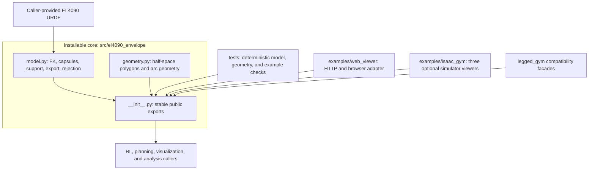

# Implementation and API

## Dependency boundary

The package core depends only on Python, NumPy, and Torch. URDF parsing uses the
standard library. It does not import Isaac Gym, simulator environments, policy
code, plotting libraries, web frameworks, project configuration, or checkpoints.

`model.py` is ordered by responsibility: immutable records and constants, URDF
loading, batched FK, capsule definitions, support math, range export, reference
selection, pinned rejection, existential rejection, deterministic sampling, and
legacy tensor assembly. `geometry.py` contains reusable, Isaac-independent
half-space intersection and kinematic arc helpers.

## Main API

- Model: `load_urdf_joints`, `BatchedUrdfKinematics`.
- Proxies: `CapsuleProxy`, `default_el4090_capsules`,
  `default_el4090_torso_capsules`.
- Support: `support_directions`, `capsule_support`, `foot_positions`,
  `reachable_foot_support`, `point_violations`, `contains_points`,
  `add_support_margin`.
- Export: `export_sample_bounding_ranges`, `export_envelope_joint_ranges`,
  `export_envelope_joint_ranges_at_reference`, `feasible_reference_q`.
- Rejection: `joint_rejection_ranges`, `haa_rejection_ranges`,
  `leg_rejection_ranges` and their immutable result records.
- Compatibility tensors: `legacy_condition_from_support`,
  `haa_ranges_from_joint_export`, `append_legacy_envelop2_observation`.
- Geometry: import viewer-independent helpers from `el4090_envelope.geometry`.

All tensors preserve caller dtype/device where practical and accept leading
batch dimensions as documented by each function. For a pose batch
$q\in\mathbb R^{B\times18}$ and $K$ directions, occupied support has shape
$B\times K$. Joint order is
`EL4090_JOINT_NAMES`; leg order is `LB, LF, LM, RB, RF, RM`. The old checkpoint
HAA order remains explicitly available as `LEGACY_HAA_ORDER`.

## Determinism and errors

Sampling APIs accept explicit seeds and use Torch Sobol engines. Empty feasible
sets carry `valid=False`, NaN numeric bounds where appropriate, or a result with
`feasible_reference=False`. Shape, disconnected URDF, invalid interval, and
degenerate direction inputs raise `ValueError` rather than silently reshaping.

The web server is an example adapter. It shapes JSON and visualization geometry
but imports all envelope math from this package. Its Live/On-release compute
switch and 2D/3D navigation are frontend concerns and are outside package core.
