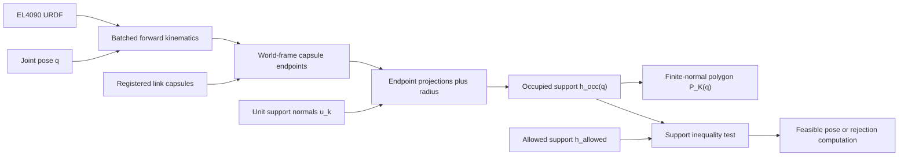
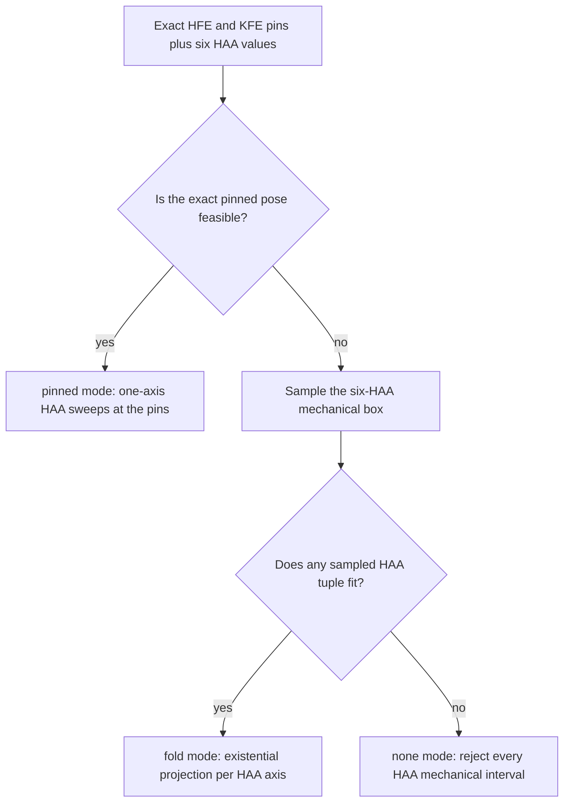

# Mathematical model

## Frame and capsule approximation

All planar quantities use the body-yaw frame $\mathcal F_B$: $+x$ points
forward, $+y$ points left, yaw is removed, and the body origin is fixed. Let
$q\in\mathbb R^J$ be the joint configuration, with $J=18$ for EL4090.

For URDF joint $j$, parent $p(j)$, fixed origin transform
$T^{\mathrm{URDF}}_{p(j),j}$, and unit rotation axis $\hat a_j$, batched forward
kinematics evaluates

$$
{}^BT_j(q)={}^{B}T_{p(j)}(q)\,T^{\mathrm{URDF}}_{p(j),j}
\begin{bmatrix}
R(\hat a_j,q_j) & 0\\
0 & 1
\end{bmatrix}.
$$

Link meshes are approximated by registered capsules. Capsule $\ell$ has local
endpoints which FK transforms to $a_\ell(q),b_\ell(q)\in\mathbb R^2$ and radius
$r_\ell\ge0$. This is an explicit collision proxy, not a mesh-complete model.

## Occupied support polygon

For $K\ge3$ evenly spaced unit normals,

$$
\theta_k=\frac{2\pi k}{K},\qquad
u_k=\begin{bmatrix}\cos\theta_k & \sin\theta_k\end{bmatrix}^{\!\top},
\qquad k=0,\ldots,K-1.
$$

The support of capsule $\ell$ and the complete occupied proxy are

$$
h_{\ell k}(q)=
\max\!\left\{u_k^\top a_\ell(q),u_k^\top b_\ell(q)\right\}+r_\ell,
\qquad
h_k^{\mathrm{occ}}(q)=\max_{\ell=1,\ldots,L}h_{\ell k}(q).
$$

The stored support values induce the finite-normal outer polygon

$$
\mathcal P_K(q)=
\left\{p\in\mathbb R^2:\
u_k^\top p\le h_k^{\mathrm{occ}}(q),\quad k=0,\ldots,K-1
\right\}.
$$

More directions reduce angular discretization error. They do not remove the
capsule approximation or convert the convex support model into exact collision
geometry.

## Allowed envelope, margin, and feasibility

An allowed polygon is represented by $h^{\mathrm{allowed}}$ on the same unit
normals. Adding a metric margin $m$ offsets every represented face exactly:

$$
h_k^{\mathrm{margin}}=h_k^{\mathrm{allowed}}+m.
$$

The maximum support excess is

$$
g(q;h^{\mathrm{allowed}})=
\max_k\left(h_k^{\mathrm{occ}}(q)-h_k^{\mathrm{allowed}}\right),
$$

and a pose is feasible at tolerance $\tau$ exactly when

$$
g(q;h^{\mathrm{allowed}})\le\tau
\quad\Longleftrightarrow\quad
h_k^{\mathrm{occ}}(q)\le h_k^{\mathrm{allowed}}+\tau
\quad\text{for every }k.
$$

For a body-frame point $p_n$, `point_violations` evaluates

$$
\rho(p_n;h)=\max_k\left(u_k^\top p_n-h_k\right).
$$

Thus $p_n$ is inside the represented envelope at point tolerance
$\varepsilon_p$ when $\rho(p_n;h)\le\varepsilon_p$.

## Reachable-foot support

Occupied body geometry and reachable feet are deliberately separate. Given a
registered sample set $Q_S=\{q_s\}_{s=1}^S$ and foot position $f_\ell(q_s)$,

$$
h_k^{\mathrm{foot}}=
\max_{s=1,\ldots,S}\max_{\ell\in\mathcal L}u_k^\top f_\ell(q_s).
$$

This is the support of the finite FK sample set. It is not a certificate for
the continuous foot workspace.

## Candidate and reference-pinned range export

For candidate configurations $Q_C$ inside mechanical box
$\mathcal B=\prod_j[l_j,u_j]$, the registered feasible subset is

$$
\widehat{\mathcal F}_C=
\left\{q\in Q_C:q\in\mathcal B\ \land\ g(q;h^{\mathrm{allowed}})\le\tau\right\}.
$$

The candidate-based exporter returns coordinatewise extrema

$$
\underline q_j=\min_{q\in\widehat{\mathcal F}_C}q_j,
\qquad
\overline q_j=\max_{q\in\widehat{\mathcal F}_C}q_j,
$$

clamped to $[l_j,u_j]$. Because arbitrary combinations from
$\prod_j[\underline q_j,\overline q_j]$ may be infeasible, a separate Sobol
audit samples that Cartesian box and reports violations.

The reference-pinned exporter validates a reference $r\in\mathcal B$, then
sweeps one joint while every other joint remains fixed:

$$
P_j^{\mathrm{ref}}=
\left\{v\in[l_j,u_j]:
g\!\left((v,r_{-j});h^{\mathrm{allowed}}\right)\le\tau
\right\}.
$$

Its interval is the minimum and maximum sampled value in
$P_j^{\mathrm{ref}}$. This is a one-dimensional section at $r$, not the
existential projection obtained by freeing the other joints.

## Rejection projections

Reference-pinned rejection is the complement of the feasible sweep:

$$
\mathcal R_j(r)=
\left\{v\in[l_j,u_j]:
g\!\left((v,r_{-j});h^{\mathrm{allowed}}\right)>\tau
\right\}.
$$

Moving another joint may recover a pinned-rejected value. HAA rejection therefore
preserves three explicit modes:

In `fold` mode, a value $v$ of target HAA joint $j$ is accessible when at least
one setting of the other five HAA joints is feasible:

$$
v\in P_j^{\mathrm{fold}}
\quad\Longleftrightarrow\quad
\exists q_{-j}^{\mathrm{HAA}}:\
g\!\left(v,q_{-j}^{\mathrm{HAA}},q^{\mathrm{HFE/KFE}}_{\mathrm{pins}};
h^{\mathrm{allowed}}\right)\le\tau.
$$

Per-leg three-DOF rejection applies the same existential idea to one leg's
HAA/HFE/KFE box while the other five legs remain pinned at a feasible reference.
It is existential within one leg, not over all 18 joints.

## Approximation and conservative bias

Existential projections use deterministic scrambled Sobol samples with default
seed $4090$, project the feasible cloud into bins, and complement observed
accessible bins. A thin accessible set can be missed, biasing the result toward
rejection. `min_rej_span` removes small sampling-noise bands.

The tuned fold defaults are $8192$ samples, $257$ bins, and a minimum rejected
span of $0.15\,\mathrm{rad}$. Fold feasibility uses every other normal when
reducing $K=32$ to $K=16$. These defaults preserve the accepted band structure
and the recorded fold-core target of $\le50\,\mathrm{ms}$ on the development
CPU; they do not establish a hardware-independent deadline.

Tolerance applies only to the support inequality. Sampled range exports and
zero observed validation violations are evidence for the registered capsules,
normals, samples, seeds, and tolerances; they are not global certificates.
