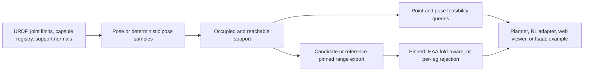

# Package usage guide

This guide shows the complete source-checkout workflow for constructing the
EL4090 model, evaluating occupied support, checking points, exporting joint
ranges, and computing rejection intervals. Mathematical definitions and
evidence boundaries are in [math.md](math.md); this document focuses on using
the API correctly.



## Install and verify

The core requires Python 3.8 or newer, NumPy, and Torch. From
`el4090_envelope/`:

```bash
python -m pip install -e .
python -m unittest discover -s tests -v
python -c "import el4090_envelope; print(el4090_envelope.__version__)"
```

Without installation, prefix commands with `PYTHONPATH=src`. The package does
not install Isaac Gym, a web framework, URDF assets, or `legged_gym`.

## Build the EL4090 model

The package reads the robot's URDF once and evaluates all leading tensor
dimensions in Torch:

```python
from pathlib import Path

import torch
from el4090_envelope import (
    BatchedUrdfKinematics,
    default_el4090_capsules,
    load_urdf_joints,
    support_directions,
)

urdf = Path("../legged_gym/resources/robots/el_4090/urdf/el_4090.urdf")
kinematics = BatchedUrdfKinematics(load_urdf_joints(urdf))
capsules = default_el4090_capsules()
directions = support_directions(32, dtype=torch.float64)
lower, upper = kinematics.joint_limits(soft_fraction=1.0, dtype=torch.float64)
```

The EL4090 joint order is `EL4090_JOINT_NAMES`; do not infer order from a
checkpoint or dictionary. The simulator leg order is `LB, LF, LM, RB, RF, RM`.
The current URDF has 18 revolute joints and full mechanical limits of
$[-3,3]\,\mathrm{rad}$. Use `soft_fraction` $<1$ only when the caller
deliberately contracts those limits.

## Occupied support and point checks

For `q` shaped `[..., 18]`, `capsule_support` returns `[..., K]` support
values. All values use the body-yaw frame: `+x` forward and `+y` left.

```python
from el4090_envelope import (
    add_support_margin,
    capsule_support,
    contains_points,
    point_violations,
)

q = torch.zeros(4, 18, dtype=torch.float64)
occupied = capsule_support(kinematics, q, capsules, directions)  # [4, 32]
allowed = add_support_margin(occupied, 0.02)                     # 2 cm faces

points = torch.tensor(
    [[[0.0, 0.0], [0.8, 0.0], [0.0, 0.8]]], dtype=torch.float64,
).expand(4, -1, -1)
inside = contains_points(points, directions, allowed, tolerance=1e-6)
excess_m = point_violations(points, directions, allowed)
```

The query computes $\rho(p;h)=\max_k(u_k^\top p-h_k)$, so $\rho\le0$ means the
point is inside every represented half-space. A positive value is the maximum
face excess in metres. Because directions are unit
normals, adding a scalar margin offsets each stored face by that metric amount.
This is an exact offset of represented faces, not a mesh-exact collision test.

## Reachable-foot support

Occupied structure and reachable feet are different sets. Use deterministic
joint samples and `reachable_foot_support` when a sampled workspace reference
is needed:

```python
from el4090_envelope import deterministic_joint_samples, reachable_foot_support

samples = deterministic_joint_samples(lower, upper, 2048, seed=4090)
foot_support = reachable_foot_support(
    kinematics, samples.unsqueeze(0), directions,
)  # [1, 32]
```

This is the support of the registered FK samples, not a certificate for the
continuous reachable workspace. Record the sample count, seed, limits, dtype,
and direction count with any result.

## Candidate-based joint-range export

`export_envelope_joint_ranges` filters candidate and validation configurations
by occupied support, then forms a coordinatewise box around feasible
candidates. A separate deterministic Sobol audit checks combinations inside
that box:

```python
from el4090_envelope import export_envelope_joint_ranges

candidate_q = deterministic_joint_samples(lower, upper, 4096, seed=4090)
validation_q = deterministic_joint_samples(lower, upper, 1024, seed=4091)
result = export_envelope_joint_ranges(
    kinematics,
    candidate_q.unsqueeze(0),
    validation_q.unsqueeze(0),
    directions,
    allowed_support=allowed[:1],
    effective_lower=lower,
    effective_upper=upper,
    capsules=capsules,
    tolerance=1e-6,
    box_validation_samples=1024,
    box_validation_seed=4092,
)

if bool(result.valid.all()):
    print(result.lower[0], result.upper[0])
print(result.diagnostics.label)
print(result.diagnostics.box_envelope_violation_count)
```

An invalid batch has `valid=False` and NaN ranges. Never replace it with the
mechanical limits. The label `conservative on registered box-validation
samples` is empirical and applies only to the declared samples and capsule
model. A coordinatewise box can combine marginally feasible values into an
infeasible pose, which is why the box audit is part of the result.

## Reference-pinned ranges and rejection

For interactive controls, first choose a validated feasible reference, then
sweep each joint with all other joints pinned:

```python
from el4090_envelope import (
    export_envelope_joint_ranges_at_reference,
    feasible_reference_q,
    joint_rejection_ranges,
)

preferred = torch.zeros(18, dtype=torch.float64)
reference, source = feasible_reference_q(
    kinematics, capsules, directions, allowed[0], lower, upper, preferred,
    fallback_candidates=candidate_q,
)
if reference is None:
    raise RuntimeError("the allowed envelope has no registered feasible reference")

pinned_box = export_envelope_joint_ranges_at_reference(
    kinematics, capsules, directions, allowed[0], lower, upper, reference,
    steps=201, box_validation_samples=512,
)
rejection = joint_rejection_ranges(
    kinematics, capsules, directions, allowed[0], lower, upper, reference,
    steps=201, fallback_candidates=candidate_q,
)
print(source, rejection.rejected_intervals)
```

Each rejected interval is conditional on the selected reference. It answers:
"with every other joint pinned here, which values of this joint exceed the
allowed support?" It does not describe the existential reachable set where
other joints may compensate.

## Fold-aware HAA and per-leg rejection

Use `haa_rejection_ranges` when HFE/KFE values are exact pins but the six HAA
joints may fold together. Its mode has operational meaning:

- `pinned`: the exact pinned pose fits; intervals come from pinned sweeps.
- `fold`: the pins do not fit, but at least one six-HAA fold fits; each HAA band
  is the complement of a sampled existential projection.
- `none`: no sampled HAA tuple fits; every HAA mechanical interval is rejected.

```python
from el4090_envelope import EL4090_JOINT_NAMES, haa_rejection_ranges

haa_indices = [
    EL4090_JOINT_NAMES.index(f"{leg}_HAA")
    for leg in ("LB", "LF", "LM", "RB", "RF", "RM")
]
haa = haa_rejection_ranges(
    kinematics, capsules, directions, allowed[0], lower, upper,
    pinned=reference, haa_joint_indices=haa_indices,
)
print(haa.mode, haa.per_haa_joint_intervals)
```

`leg_rejection_ranges` performs a separate three-DOF existential projection
for each leg while other legs remain at a feasible reference:

```python
from el4090_envelope import leg_rejection_ranges

per_leg = leg_rejection_ranges(
    kinematics, capsules, directions, allowed[0], lower, upper, reference,
    fallback_candidates=candidate_q,
    free_samples=8192,
    steps=257,
    seed=4090,
)
if per_leg.feasible_reference:
    print(per_leg.per_leg_intervals)
```

Both existential APIs use deterministic sampled projections. Preserve their
sample counts, bins/steps, minimum rejected-span threshold, seed, and tolerance
when comparing results. They are repeatable approximations, not continuous
optimization certificates.

## Batching, dtype, and device

- `q` may have arbitrary leading batch dimensions; its last dimension is 18.
- Direction and support tensors are converted to the pose dtype/device.
- Construct limits, reference poses, and samples on one dtype/device to avoid
  accidental host transfers.
- Float64 is useful for regression/oracle checks; float32 is the normal runtime
  choice. Validate tolerances explicitly when changing dtype.
- Sampling functions are deterministic for a fixed Torch version, seed, dtype,
  limits, and sample count.

## Legacy adapters

Existing imports from `legged_gym.utils.envelop.kinematic_envelope` and
`gym_envelope_geometry` remain thin facades. New code should import the package
directly. Observation compatibility helpers preserve `[B,8]`, `[B,6,2]`, and
`[B,83]` shapes, but shape compatibility alone does not prove policy-equivalent
behavior.

## Runnable examples

- [Web viewer](../examples/web_viewer/README.md): browser-based pose, envelope,
  rejection, compute-policy, and 2D/3D inspection.
- [Isaac Gym examples](isaac_gym_examples.md): original kinematic, LiDAR, and
  legacy-slider viewers, now owned by `examples/isaac_gym/`.

The Isaac examples require the sibling `legged_gym/resources` tree and Isaac
Gym Preview 4. They are optional and are not part of the core wheel.
