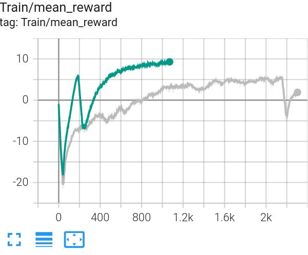
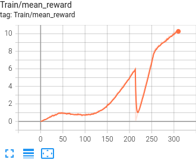
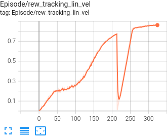
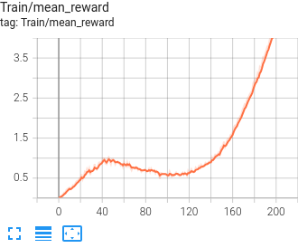
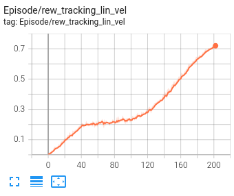

# ElSpider Air Robot Tasks

## Environment Setup

```bash
conda activate pdplanner
```

## Basic Tasks

### ElSpiderAir Flat Terrain

**Training Epoch:** ~300

**Training Profile:**

- 70 epoch: velocity tracking reward grows up
- 160 epoch: enter reward stage 1
- 300 epoch: walking good

**Training Epoch:** ~500 (Actuator Net Disabled)

**Training Profile:**

- 100 epoch: velocity tracking reward grows up
- 250 epoch: enter reward stage 1
- 500 epoch: walking good

```bash
python legged_gym/scripts/train.py --task=elspider_air_flat --num_envs=4096 --headless --resume
python legged_gym/scripts/play.py --task=elspider_air_flat --num_envs=48 --checkpoint=-1  --load_run=Dec05_21-36-11_ --resume
```

**Slight Rough for Better Sim2Sim Robustness**:
Training Profile(grey):


```bash
python legged_gym/scripts/train.py --task=elspider_air_slight_rough --num_envs=4096 --headless --resume
python legged_gym/scripts/play.py --task=elspider_air_slight_rough --num_envs=48 --checkpoint=-1  --load_run=Dec05_21-36-11_ --resume
```

### ElSpiderAir Rough Terrain

**Training Tip:**
IMPORTANT

Use multi-stage training to achieve better performance. Stage0 focuses on basic walking skills on `plane`, while Stage1 introduces rough terrain for fine-tuning.

- Stage0: Pretrain model on flat terrain to learn basic walking skills (gaits, etc.).
- Stage1: Use the pretrained model to finetune on rough terrain.

**Training Profile:**


**Single Stage(Test only)**
```bash
python legged_gym/scripts/train.py --task=elspider_air_rough --num_envs=4096 --resume --headless
python legged_gym/scripts/play.py --task=elspider_air_rough --num_envs=48 --checkpoint=-1
```

**Multi Stage**
```bash
# Train Stage 0 for ~550 epochs
python legged_gym/scripts/train.py --task=elspider_air_rough_multi_stage0 --num_envs=4096 --headless
python legged_gym/scripts/train.py --task=elspider_air_rough_multi_stage1 --num_envs=4096 --headless --resume
python legged_gym/scripts/play.py --task=elspider_air_rough_multi_stage1 --num_envs=48 --checkpoint=-1
```

**Distillation (Teacher-Student)**

Train a student policy using distillation from a trained teacher model. The teacher uses privileged terrain information (height scans), while the student only uses proprioceptive history.

```bash
# First, train a teacher model (use multi-stage training for best results)
python legged_gym/scripts/train.py --task=elspider_air_rough_multi_stage0 --num_envs=4096 --headless
python legged_gym/scripts/train.py --task=elspider_air_rough_multi_stage1 --num_envs=4096 --headless --resume

# Update teacher_model_path in elspider_air_rough_student_config.py with the trained teacher checkpoint
# Then train the student policy via distillation
# PROBLEM: The distilled policy are not good judging from data, but it can walk in terrain.
python legged_gym/scripts/train.py --task=elspider_air_rough_student --num_envs=4096 --headless

# Evaluate the student policy
python legged_gym/scripts/play.py --task=elspider_air_rough_student --num_envs=48 --checkpoint=-1
```


### ElSpiderAir Rough RayCast

```bash
python legged_gym/scripts/train.py --task=elspider_air_rough_raycast --num_envs=6144 --resume --headless
python legged_gym/scripts/play.py --task=elspider_air_rough_raycast --num_envs=8 --checkpoint=-1
```

## Other Tasks

### ElSpiderAir Batch Rollout

**Test Commands:**

```bash
python legged_gym/tests/test_batch_rollout_env.py --task=elspider_air_batch_rollout --num_envs=10

python legged_gym/tests/test_play_batch_rollout_env.py --task=elspider_air_batch_rollout --num_envs=10 --checkpoint=-1

python legged_gym/tests/test_play_batch_rollout_env.py --task=elspider_air_batch_rollout_flat --num_envs=10 --checkpoint=-1
```

Train ElSpider Air with batch rollout capability for trajectory optimization.

**Training Epoch:** ~500

**Training Profile (Actuator Net Disabled):**

- **Plane, 6144 Envs**
    - 150 epoch: velocity tracking reward grows up
    - 250 epoch: enter reward stage 1
    - 500 epoch: walking good

    
    

- **Confined, 4096 Envs**
    - ? epoch: velocity tracking reward grows up
    - ? epoch: enter reward stage 1
    - ? epoch: walking good

```bash
python legged_gym/scripts/train.py --task=elspider_air_batch_rollout --num_envs=4096 --resume --headless
python legged_gym/scripts/play.py --task=elspider_air_batch_rollout --num_envs=32 --checkpoint=-1
```

### ElSpiderAir Batch Rollout Flat

Train ElSpider Air with batch rollout capability on flat terrain (without perception features).

**Training Profile:**
6144 envs




```bash
python legged_gym/scripts/train.py --task=elspider_air_batch_rollout_flat --num_envs=6144 --resume --headless
python legged_gym/scripts/play.py --task=elspider_air_batch_rollout_flat --num_envs=32 --checkpoint=-1
```

### ElSpiderAir Trajectory Gradient Sampling

Train ElSpider Air with gradient sampling for trajectory optimization.

**Test Commands:**

```bash
python legged_gym/tests/test_play_batch_rollout_env.py --task=elspider_air_traj_grad_sampling --num_envs=10 --checkpoint=-1
```

**Rollout:**

```bash
python legged_gym/scripts/train.py --task=elspider_air_traj_grad_sampling --num_envs=6144 --resume --headless
python legged_gym/scripts/play.py --task=elspider_air_traj_grad_sampling --num_envs=32 --checkpoint=-1
```


### BasePoseAdapt ElSpiderAir

Train ElSpider Air with base pose adaptation for collision avoidance.

**Training Commands:**

```bash
python legged_gym/scripts/train.py --task=el_mini_base_pose_adapt --num_envs=4096 --resume --headless
python legged_gym/scripts/play.py --task=el_mini_base_pose_adapt --num_envs=48 --checkpoint=-1
```

**Test Base Pose Control:**

```bash
python legged_gym/scripts/train.py --task=el_mini_base_pose_ctrl --num_envs=48
```


### Pose ElSpiderAir Flat

Train ElSpider Air for pose control on flat terrain.

```bash
python legged_gym/scripts/train.py --task=pose_elspider_air_flat --num_envs=6144 --resume --headless
python legged_gym/scripts/play.py --task=pose_elspider_air_flat --num_envs=48 --checkpoint=-1
```

### FootTrack ElSpiderAir

**Hang Up Mode:**

```bash
python legged_gym/scripts/train.py --task=foot_track_elspider_air_hang --num_envs=6144 --resume --headless
python legged_gym/scripts/play.py --task=foot_track_elspider_air_hang --num_envs=48 --checkpoint=-1
```

**On Ground Mode:**

```bash
python legged_gym/scripts/train.py --task=foot_track_elspider_air_flat --num_envs=6144 --resume --headless
python legged_gym/scripts/play.py --task=foot_track_elspider_air_flat --num_envs=48 --checkpoint=-1
```

